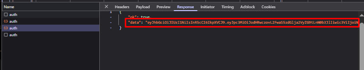

# Руководство по настройке

Пошаговая инструкция по установке и настройке автоматизированной системы покупки стикеров.

## Системные требования

- Python 3.8+
- Стабильное интернет-соединение
- Активный аккаунт Stickerdom

**Примечание**: При первом запуске автоматически создается папка `data/` для хранения базы данных и файлов сессий.

## Настройка переменных окружения

### 1. JWT токен Stickerdom

**⚠️ ВАЖНО**: Токен действует только 60 минут!

#### Пошаговая инструкция:

1. **Залогиньтесь в Telegram в браузере** (на аккаунт для которого будут покупаться стикеры)
   - Откройте DevTools (F12)
   - Перейдите в личку с Sticker Pack: https://web.telegram.org/a/#7686366470
   - Нажмите "Open"

   

2. **В поиске DevTools** найдите запрос содержащий `auth`

   

3. **Во вкладке Response** скопируйте JWT токен

   

4. **Добавьте в `.env`:**
```env
STICKERDOM_JWT_TOKEN=ваш_jwt_токен
```

### 2. Методы оплаты

```env
PAYMENT_METHODS=TON,STARS  # Оба метода (рекомендуется)
```

### 3. TON кошелек

```env
TON_SEED_PHRASE=ваша_seed_фраза_кошелька
TON_ENDPOINT=mainnet
```

**Требования:** минимум 0.1 TON на балансе, тип кошелька WalletV5R1

### 4. Telegram Stars (через Telethon API)

#### Получение API ключей:
1. Перейдите на https://my.telegram.org/apps
2. Создайте новое приложение
3. Скопируйте API ID и Hash

```env
TELEGRAM_API_ID=1234567
TELEGRAM_API_HASH=abcdef1234567890abcdef1234567890
TELEGRAM_PHONE=+71234567890
TELEGRAM_SESSION_NAME=stars_payment_session
```

#### Расширенная конфигурация Stars:
```env
# Профиль производительности: conservative/balanced/aggressive/extreme
STARS_PROFILE=balanced

# Максимум покупок за сессию
STARS_MAX_PURCHASES_PER_SESSION=3

# Интервал между покупками (секунды)
STARS_PURCHASE_INTERVAL=2.0

# Таймауты для операций Stars (секунды)
STARS_PAYMENT_TIMEOUT=120
STARS_INVOICE_TIMEOUT=30

# Адаптивная система (рекомендуется)
STARS_ADAPTIVE_LIMITS=true
```

#### Первый запуск:
При первом запуске потребуется пройти авторизацию в Telegram:

1. **Автоматическая настройка**:
   ```bash
   python main.py 1/1 --test
   ```
   
2. **Если возникли проблемы с авторизацией**, используйте интерактивную настройку:
   - Система запросит SMS код
   - При наличии 2FA - пароль Cloud Password  
   - Сессия сохранится в `data/stars_payment_session.session`

3. **Проверка подключения**:
   ```bash
   python main.py 1/1 --session-info
   ```

### 5. CAPTCHA решение

```env
CAPTCHA_ENABLED=true
ANTICAPTCHA_API_KEY=ваш_ключ_anticaptcha
CAPTCHA_TIMEOUT=300
```

**Настройка Anti-captcha.com:**
1. Регистрация на https://anti-captcha.com
2. Пополните баланс (минимум $5)
3. Скопируйте API ключ из Settings → API

### 6. Уведомления

```env
TELEGRAM_BOT_TOKEN=токен_бота_уведомлений
TELEGRAM_CHAT_ID=ваш_chat_id
```

**Создание бота:**
1. Напишите @BotFather в Telegram
2. Отправьте `/newbot`
3. Скопируйте токен бота

**Получение Chat ID:**
1. Напишите сообщение вашему боту
2. Откройте: `https://api.telegram.org/bot<ВАШ_ТОКЕН>/getUpdates`
3. Найдите `"chat":{"id":123456789}`

## Rate Limiter профили

Система предоставляет пять предустановленных профилей производительности для различных сценариев использования:

### Safe Mode (--safe)
- **Скорость**: Медленная
- **Безопасность**: Максимальная  
- **Описание**: Самый осторожный режим работы с большими паузами между запросами
- **Когда использовать**: Для тестирования, изучения системы, или если не торопитесь
- **Риски**: Практически отсутствуют

### Balanced Mode (--balanced, по умолчанию)
- **Скорость**: Средняя
- **Безопасность**: Хорошая
- **Описание**: Оптимальный баланс скорости и безопасности для повседневного использования
- **Когда использовать**: В большинстве случаев, стандартные покупки
- **Риски**: Минимальные, изредка может получить предупреждение от API

### Fast Mode (--fast)  
- **Скорость**: Быстрая
- **Безопасность**: Умеренная
- **Описание**: Ускоренный режим для солдаутов средней скорости (2-6 минут)
- **Когда использовать**: Обычные дропы, когда нужна хорошая скорость
- **Риски**: Низкие, возможны кратковременные задержки

### Aggressive Mode (--aggressive)
- **Скорость**: Очень быстрая  
- **Безопасность**: Пониженная
- **Описание**: Агрессивный режим для быстрых солдаутов (1-2 минуты)
- **Когда использовать**: Популярные дропы, которые быстро раскупаются
- **Риски**: Возможны блокировки на 5-15 минут

### Extreme Mode (--extreme)
- **Скорость**: Максимальная
- **Безопасность**: Низкая
- **Описание**: Экстремальный режим для мгновенных солдаутов
- **Когда использовать**: Только в критических ситуациях при слишком большом ажиотаже
- **Риски**: Высокая вероятность получить долгую блокировку или бан

### Использование профилей

#### Через командную строку:
```bash
# Посмотреть все профили
python main.py 2/19 --list-profiles

# Использовать конкретный профиль
python main.py 2/19 --fast --once
python main.py 2/19 --aggressive --continuous
python main.py 2/19 --profile=extreme --once

# Комбинирование с другими режимами
python main.py 2/19 --fast --test          # Тест с fast профилем
python main.py 2/19 --aggressive --dry-run # Симуляция с aggressive
```

## Как найти ID коллекции и персонажа

### Что такое ID

Формат команды: `персонаж_id/коллекция_id` (например, `2/19`)

### Как найти ID

**Самый простой способ - прямо из URL веб-версии:**

1. Откройте @sticker_nft_bot
2. Запустите мини апку
2. Найдите нужную коллекцию и персонажа и нажмите посмотреть в web
3. Посмотрите на URL: `https://stickerdom.store/bundle/2/19`
4. Числа в URL уже в нужном формате: `персонаж_id/коллекция_id`

### Пример
URL: `https://stickerdom.store/bundle/2/19` → команда:
```bash
python main.py 2/19
```

Просто копируйте числа из URL после `/bundle/` в том же порядке. Для коллекций, что ещё не вышли можно "угадать" основываясь на предыдущей последней. Условно, последняя была 1/25, значит следуйщая будет 1/26(если стикеров от данной коллекции ещё не было)

#### Через переменные окружения:
```env
RATE_LIMITER_PROFILE=fast
```

## Stars Профили

| Профиль | Команда | Покупки/сессия | Интервал |
|---------|---------|----------------|----------|
| Conservative | `--stars-conservative` | 2 | 5.0s |
| Balanced | `--stars-balanced` | 3 | 2.0s |
| Aggressive | `--stars-aggressive` | 5 | 1.0s |
| Extreme | `--stars-extreme` | 8 | 0.5s |

```bash
# Использование
python main.py 2/19 --stars-balanced --once
python main.py 2/19 --session-info

# Через переменные окружения
STARS_PROFILE=aggressive python main.py 2/19
```

**Покупки за сессию** - количество успешно завершенных покупок (не инвойсов) до автоматической паузы на `STARS_SESSION_COOLDOWN` секунд.

**Адаптивная система**: Автоматическая коррекция интервалов на основе качества сессии и Circuit Breaker защита при ошибках.

**Документация**: [STARS_OPTIMIZATION.md](STARS_OPTIMIZATION.md)

## Тестирование конфигурации

### Полная диагностика
```bash
python run_tests.py
```

### Тест конфигурации
```bash
python main.py 2/19 --test
```

### Тест с профилем
```bash
python main.py 2/19 --fast --test
```

### Симуляция без транзакций
```bash
python main.py 2/19 --dry-run
```

## Различия между интеграциями Telegram

| Аспект | Stars платежи (Telethon) | Уведомления (Bot API) |
|--------|-------------------------|----------------------|
| **Библиотека** | Telethon | pytelegrambotapi |
| **Настройки** | TELEGRAM_API_ID/HASH | TELEGRAM_BOT_TOKEN |
| **Назначение** | Оплата стикеров | Отправка уведомлений |
| **Аутентификация** | SMS код при первом запуске | Готовый токен бота |

## Устранение проблем

### Проблемы с JWT токеном
- Токен истёк (60 минут) - получите новый
- Неверный формат - проверьте копирование из DevTools

### Проблемы с TON кошельком
- Недостаточно средств - минимум 0.1 TON
- Неверная seed фраза - проверьте правильность ввода

### Проблемы с Telethon
- **Ошибка аутентификации** - удалите файлы сессий в папке `data/` и авторизуйтесь заново:
  ```bash
  python main.py 1/1 --clear-session
  python main.py 1/1 --test
  ```
- **Неверные API ключи** - проверьте настройки на my.telegram.org
- **2FA проблемы** - убедитесь что вводите правильный Cloud Password

### Проблемы с CAPTCHA
- Недостаточно средств на Anti-captcha.com
- Неверный API ключ - проверьте в настройках аккаунта 