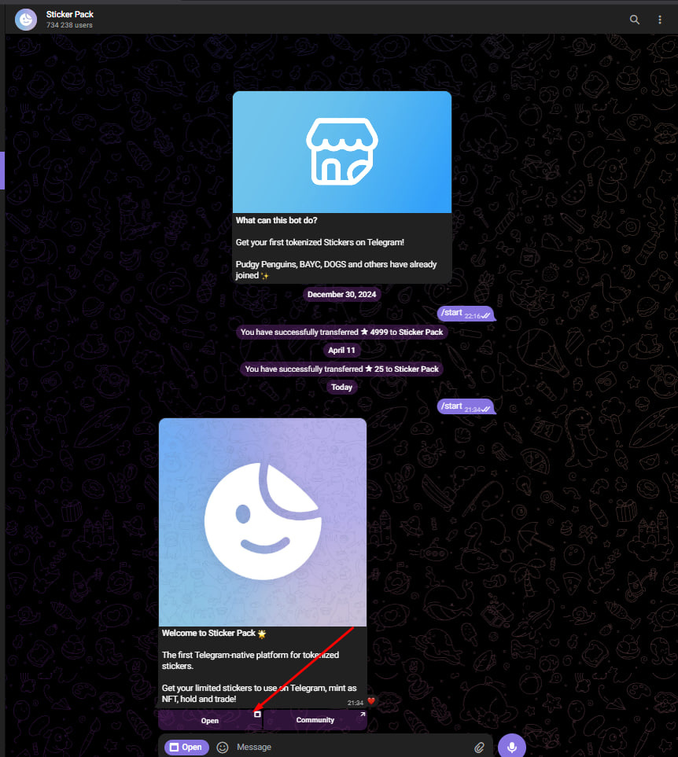
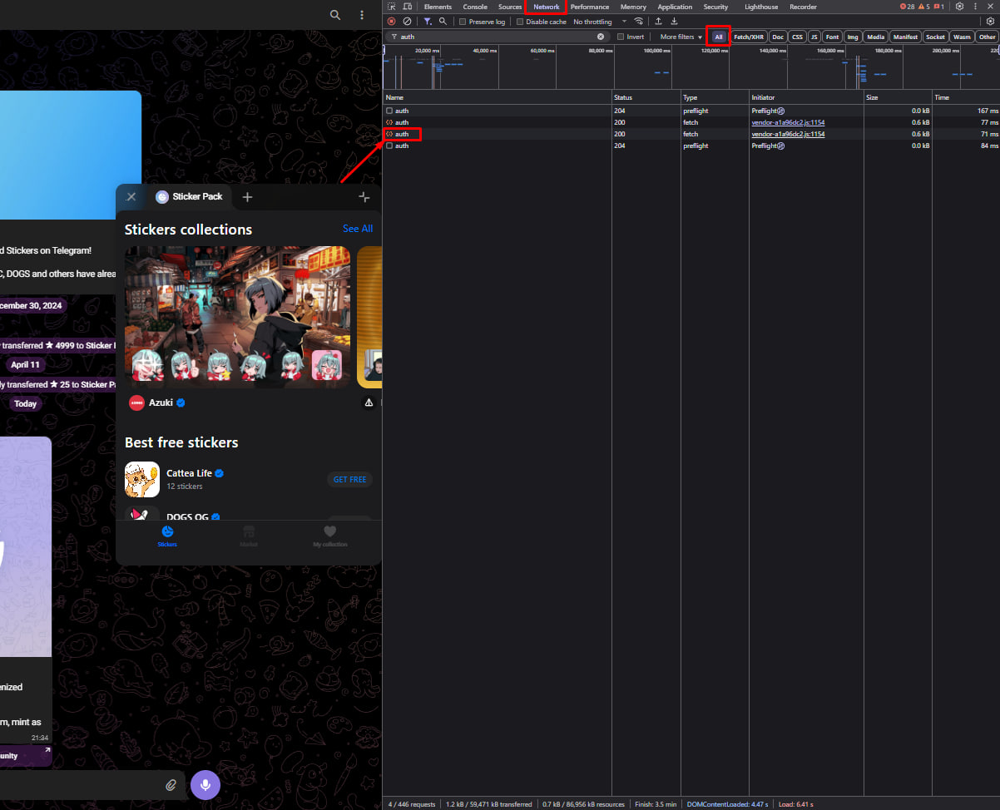
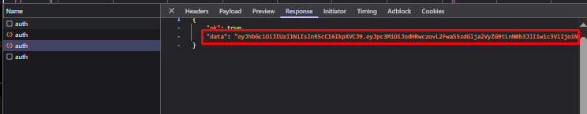

# Конфигурация

## Создание .env файла

Скопируйте `env.example` в `.env` и заполните параметры:
```bash
cp env.example .env
```

## JWT токен Stickerdom

**Токен действует только 60 минут**

1. **Залогиньтесь в Telegram в браузере** (в аккаунт на котором будут покупаться стикеры)
   - Откройте DevTools (F12)
   - Перейдите в личку с Sticker Pack: https://web.telegram.org/a/#7686366470
   - Нажмите "Open"

   

2. **В поиске DevTools** найдите запрос содержащий `auth`

   

3. **Во вкладке Response** скопируйте JWT токен

   

```env
STICKERDOM_JWT_TOKEN=ваш_jwt_токен
```

## Методы оплаты

```env
PAYMENT_METHODS=TON,STARS  # Рекомендуются оба метода
```

## TON кошелек

```env
TON_SEED_PHRASE=ваша_seed_фраза
TON_ENDPOINT=mainnet
```

**Требования:** минимум 0.1 TON, тип кошелька WalletV5R1

## Telegram Stars

### API ключи:
Получите на https://my.telegram.org/apps

```env
TELEGRAM_API_ID=1234567
TELEGRAM_API_HASH=ваш_api_hash
TELEGRAM_PHONE=+71234567890
TELEGRAM_SESSION_NAME=stars_session
```

### Настройки производительности:
```env
STARS_PROFILE=balanced
STARS_MAX_PURCHASES_PER_SESSION=3
STARS_PURCHASE_INTERVAL=2.0
STARS_ADAPTIVE_LIMITS=true
```

## CAPTCHA

```env
CAPTCHA_ENABLED=true
ANTICAPTCHA_API_KEY=ваш_ключ_anticaptcha
CAPTCHA_TIMEOUT=300
```

## Уведомления

```env
TELEGRAM_BOT_TOKEN=токен_бота
TELEGRAM_CHAT_ID=ваш_chat_id
```

## Rate Limiter

```env
RATE_LIMITER_ENABLED=true
RATE_LIMITER_MAX_DELAY=300
RATE_LIMITER_CIRCUIT_BREAKER_THRESHOLD=3
```

## Адаптивные эндпоинты

```env
ENDPOINT_VALIDATION_ENABLED=true
ENDPOINT_VALIDATION_TIMEOUT=2.0
SELENIUM_HEADLESS_DISABLED=false
```

## Проверка конфигурации

```bash
# Тест подключения
python main.py 1/1 --test

# Проверка Stars авторизации
python main.py 1/1 --session-info
``` 